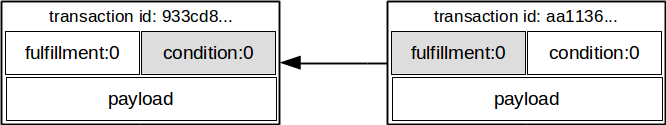
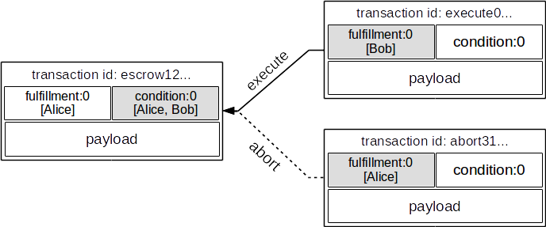
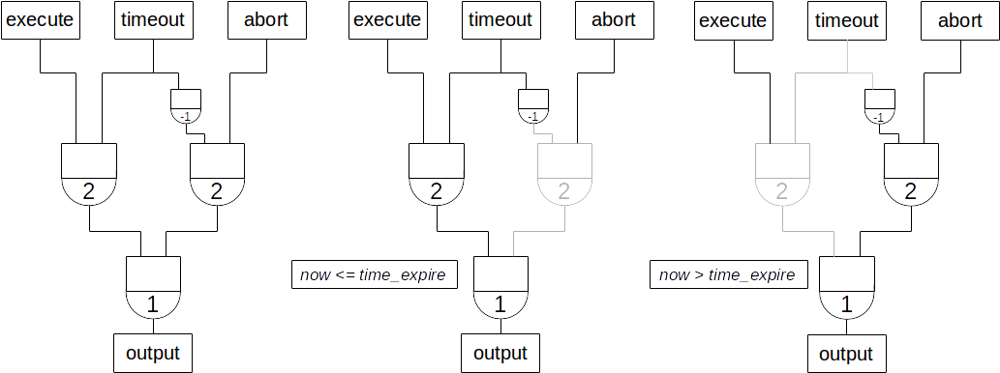

.. _advanced-usage:

=======================
Advanced Usage Examples
=======================

This section has examples of using the Python Driver for more advanced use
cases such as escrow.

.. todo:: This is work in progress. More examples will gradually appear as issues like

    * https://github.com/bigchaindb/bigchaindb-driver/issues/110

    are taken care of.

Getting Started
---------------

First, make sure you have RethinkDB and BigchainDB Server
`installed and running <https://docs.bigchaindb.com/projects/server/en/latest/dev-and-test/setup-run-node.html>`_,
e.g.:

.. code-block:: bash

    $ rethinkdb --daemon
    $ bigchaindb configure
    $ bigchaindb start

Don't shut them down!

Next, make sure you've :doc:`installed the bigchaindb_driver Python package <quickstart>`.
Then, in a new terminal, run an IPython shell:

.. code-block:: bash

    $ ipython

Make sure it's Python 3.
Now we can import the :class:`~bigchaindb_driver.BigchainDB` class and create
an instance:

.. ipython::

    In [0]: from bigchaindb_driver import BigchainDB

    In [0]: bdb = BigchainDB()

This instantiates an object ``bdb`` of class
:class:`~bigchaindb_driver.BigchainDB`. When instantiating a
:class:`~bigchaindb_driver.BigchainDB` object without arguments (as above), it
uses the default BigchainDB Root URL Endpoint ``http://localhost:9984``.

If you want to connect to something other than a BigchainDB node on localhost,
see :doc:`the page about other connection options <connect>`.

Create a Digital Asset
----------------------

At a high level, a "digital asset" is something which can be represented
digitally and can be assigned to a user. In BigchainDB, users are identified by
their public key, and the data payload in a digital asset is represented using
a generic `Python dict <https://docs.python.org/3.4/tutorial/datastructures.html#dictionaries>`_.

In BigchainDB, digital assets can be created by doing a special kind of
transaction: a ``CREATE`` transaction.

.. ipython::

    In [0]: from bigchaindb_driver.crypto import generate_keypair

Create a test user: alice

.. ipython::

    In [0]: alice = generate_keypair()

Define a digital asset data payload

.. ipython::

    In [0]: digital_asset_payload = {'data': {'msg': 'Hello BigchainDB!'}}

    In [0]: tx = bdb.transactions.prepare(operation='CREATE',
       ...:                               signers=alice.public_key,
       ...:                               asset=digital_asset_payload)

All transactions need to be signed by the user creating the transaction.

.. ipython::

    In [0]: signed_tx = bdb.transactions.fulfill(tx, private_keys=alice.private_key)

    In [0]: signed_tx

Write the transaction to BigchainDB. The transaction will be stored in a
backlog where it will be validated before being included in a block.

.. code-block:: python

    >>> sent_tx = bdb.transactions.send(signed_tx)

Note that the transaction payload returned by the BigchainDB node is equivalent
to the signed transaction payload.

.. code-block:: python

    >>> sent_tx == signed_tx
    True

Read the Creation Transaction from the DB
-----------------------------------------

After a couple of seconds, we can check if the transaction was validated in a
block:

.. code-block:: python

    # Retrieve a validated transaction
    >>> tx_retrieved = bdb.transactions.retrieve(tx['id'])

The new owner of the digital asset is now Alice (or more correctly, her *public
key*):

.. ipython::

    In [0]: alice.public_key

Transfer the Digital Asset
--------------------------

Now that ``alice`` has a digital asset assigned to her, she can transfer it to
another person. Transfer transactions require an input. The input will be the
transaction id of a digital asset that was assigned to ``alice``, which in our
case is

.. ipython::

    In [0]: signed_tx['id']

BigchainDB makes use of the `crypto-conditions library <https://github.com/bigchaindb/cryptoconditions>`_
to cryptographically lock and unlock transactions. The locking script is
referred to as a ``condition`` (put inside an "output") and a corresponding
``fulfillment`` (put inside an "input") unlocks the output condition of an
``input_tx``.

Since a transaction can have multiple outputs each with their own
(crypto)condition, each transaction input is required to refer to the output
condition that they fulfill via ``fulfills['output']``.

In order to prepare a transfer transaction, Alice needs to provide at least
three things:

1. ``inputs`` -- one or more fulfillments that fulfill a prior transaction's
   output conditions.
2. ``asset['id']`` -- the id of the asset being transferred.
3. Recipient ``public_keys`` -- one or more public keys representing the new
   recipients(s).

To construct the input:

.. ipython::

    In [0]: output_index = 0

    In [0]: output = tx['outputs'][output_index]

    In [0]: input_ = {
       ...:     'fulfillment': output['condition']['details'],
       ...:     'fulfills': {
       ...:         'output': output_index,
       ...:         'txid': tx['id'],
       ...:     },
       ...:     'owners_before': output['public_keys'],
       ...: }

The asset in a ``TRANSFER`` transaction must be a dictionary with an ``id`` key
denoting the asset to transfer. This asset id is either the id of the
``CREATE`` transaction of the asset (as it is in this case), or is the
``asset['id']`` property in a ``TRANSFER`` transaction (note that this value
simply points to the id of the asset's ``CREATE`` transaction):

.. ipython::

    In [0]: transfer_asset_id = tx['id']

    In [0]: transfer_asset = {
       ...:     'id': transfer_asset_id,
       ...: }

Create a second test user, ``bob``:

.. ipython::

    In [0]: bob = generate_keypair()

    In [0]: bob.public_key

And prepare the transfer transaction:

.. ipython::

    In [0]: tx_transfer = bdb.transactions.prepare(
       ...:     operation='TRANSFER',
       ...:     inputs=input_,
       ...:     asset=transfer_asset,
       ...:     recipients=bob.public_key,
       ...: )

The ``tx_transfer`` dictionary should look something like:

.. ipython::

    In [0]: tx_transfer

Notice, ``bob``'s public key, appearing in the above ``dict``.

.. ipython::

    In [0]: tx_transfer['outputs'][0]['public_keys'][0]

    In [0]: bob.public_key

The transaction now needs to be fulfilled by ``alice``:

.. ipython::

    In [0]: signed_tx_transfer = bdb.transactions.fulfill(
       ...:     tx_transfer,
       ...:     private_keys=alice.private_key,
       ...: )

If you look at the content of ``signed_tx_transfer`` you should see the added
fulfilment uri, holding the signature:

.. ipython::

    In [0]: signed_tx_transfer

More precisely:

.. ipython::

    In [0]: signed_tx_transfer['inputs'][0]['fulfillment']

We have yet to send the transaction over to a BigchainDB node, as both
preparing and fulfilling a transaction are done "offchain," that is, without
the need to have a connection to a BigchainDB federation.

.. code-block:: python

    sent_tx_transfer = bdb.transactions.send(signed_tx_transfer)

Again, as with the ``'CREATE'`` transaction, notice how the payload returned
by the server is equal to the signed one.

.. code-block:: python

    >>> sent_tx_transfer == signed_tx_transfer
    True

Double Spends
-------------

BigchainDB makes sure that a user can't transfer the same digital asset two or
more times (i.e. it prevents double spends).

If we try to create another transaction with the same input as before, the
transaction will be marked invalid and the validation will throw a double spend
exception.

Let's suppose that Alice tries to re-send the asset back to her "secret"
account.

.. ipython::

    In [0]: alice_secret_stash = generate_keypair()

Create another transfer transaction with the same input

.. ipython::

    In [0]: tx_transfer_2 = bdb.transactions.prepare(
       ...:     operation='TRANSFER',
       ...:     inputs=input_,
       ...:     asset=transfer_asset,
       ...:     recipients=alice_secret_stash.public_key,
       ...: )

Fulfill the transaction

.. ipython::

    In [0]: fulfilled_tx_transfer_2 = bdb.transactions.fulfill(
       ...:     tx_transfer_2,
       ...:     private_keys=alice.private_key,
       ...: )

Send the transaction over to the node

.. code-block:: python

    >>> from bigchaindb_driver.exceptions import BigchaindbException
    >>> try:
    ...     bdb.transactions.send(fulfilled_tx_transfer_2)
    ... except BigchaindbException as e:
    ...     print(e.info)

    {'message': 'Invalid transaction', 'status': 400}

.. todo:: Update the above output once
    https://github.com/bigchaindb/bigchaindb/issues/664 is taken care of.

.. _car-multiple-owners:

Multiple Owners
---------------

Say ``alice`` and ``bob`` own a car together:

.. ipython::

    In [0]: car_asset = {
       ...:     'data': {
       ...:         'car': {
       ...:             'vin': '5YJRE11B781000196'
       ...:         }
       ...:     }
       ...: }

and they agree that ``alice`` will be the one issuing the asset. To create a
new digital asset with `multiple` owners, one can simply provide a
list or tuple of ``recipients``:

.. ipython::

    In [0]: car_creation_tx = bdb.transactions.prepare(
       ...:     operation='CREATE',
       ...:     signers=alice.public_key,
       ...:     recipients=(alice.public_key, bob.public_key),
       ...:     asset=car_asset,
       ...: )

    In [0]: signed_car_creation_tx = bdb.transactions.fulfill(
       ...:     car_creation_tx,
       ...:     private_keys=alice.private_key,
       ...: )

.. code-block:: python

    >>> sent_car_tx = bdb.transactions.send(signed_car_creation_tx)

    >>> sent_car_tx == signed_car_creation_tx
    True

One day, ``alice`` and ``bob``, having figured out how to teleport themselves,
and realizing they no longer need their car, wish to transfer the ownership of
their car over to ``carol``:

.. ipython::

    In [0]: carol = generate_keypair()

In order to prepare the transfer transaction, ``alice`` and ``bob`` need the
input:

.. ipython::

    In [0]: output_index = 0

    In [0]: output = signed_car_creation_tx['outputs'][output_index]

    In [0]: input_ = {
       ...:     'fulfillment': output['condition']['details'],
       ...:     'fulfills': {
       ...:         'output': output_index,
       ...:         'txid': signed_car_creation_tx['id'],
       ...:     },
       ...:     'owners_before': output['public_keys'],
       ...: }

Let's take a moment to contemplate what this ``input_`` is:

.. ipython::

    In [0]: input_

and the asset (because it's a ``CREATE`` transaction):

.. ipython::

    In [0]: transfer_asset = {
       ...:     'id': signed_car_creation_tx['id'],
       ...: }

then ``alice`` can prepare the transfer:

.. ipython::

    In [0]: car_transfer_tx = bdb.transactions.prepare(
       ...:     operation='TRANSFER',
       ...:     recipients=carol.public_key,
       ...:     asset=transfer_asset,
       ...:     inputs=input_,
       ...: )

The asset can be transfered as soon as each of the original transaction's
``signers`` fulfills the transaction, that is ``alice`` and ``bob``.

To do so, simply provide a list of all private keys to the fulfill method.

.. danger:: We are currently working to support partial fulfillments, such that
    not all keys of all parties involved need to be supplied at once. The issue
    `bigchaindb/bigchaindb/issues/729 <https://github.com/bigchaindb/bigchaindb/issues/729>`_
    addresses the current limitation. Your feedback is welcome!

.. ipython::

    In [0]: signed_car_transfer_tx = bdb.transactions.fulfill(
       ...:     car_transfer_tx, private_keys=[alice.private_key, bob.private_key]
       ...: )

Note, that if one of the private keys is missing, the fulfillment will fail. If
we omit ``bob``:

.. ipython::

    In [0]: from bigchaindb_driver.exceptions import MissingPrivateKeyError

    In [0]: try:
       ...:     signed_car_transfer_tx = bdb.transactions.fulfill(
       ...:         car_transfer_tx,
       ...:         private_keys=alice.private_key,
       ...:     )
       ...: except MissingPrivateKeyError as e:
       ...:     print(e, e.__cause__, sep='\n')

Notice ``bob``'s public key in the above message:

.. ipython::

    In [0]:  bob.public_key

And the same goes for ``alice``. Try it!

Sending the transaction over to a BigchainDB node:

.. code-block:: python

    sent_car_transfer_tx = bdb.transactions.send(signed_car_transfer_tx)

if ``alice`` and ``bob`` wish to check the status of the transfer they may use
the :meth:`~bigchaindb_driver.BigchainDB.transactions.status` endpoint:

.. code-block:: python

    >>> bdb.transactions.status(sent_car_transfer_tx['id'])
    {'status': 'valid'}

Done!

Happy, ``alice`` and ``bob`` have successfully transferred the ownership of
their car to ``carol``, and can go on exploring the countless galaxies of the
universe using their new teleportation skills.

Crypto-Conditions (Advanced)
----------------------------

Introduction
~~~~~~~~~~~~
Crypto-conditions provide a mechanism to describe a signed message such that
multiple actors in a distributed system can all verify the same signed message
and agree on whether it matches the description.

This provides a useful primitive for event-based systems that are distributed
on the Internet since we can describe events in a standard deterministic manner
(represented by signed messages) and therefore define generic authenticated
event handlers.

Crypto-conditions are part of the Interledger protocol and the full
specification can be found
`here <https://interledger.org/five-bells-condition/spec.html>`_.

Implementations of the crypto-conditions are available in
`Python <https://github.com/bigchaindb/cryptoconditions>`_,
`JavaScript <https://github.com/interledger/five-bells-condition>`_, and
`Java <https://github.com/interledger/java-crypto-conditions>`_.

Threshold Conditions
~~~~~~~~~~~~~~~~~~~~

Threshold conditions introduce multi-signatures, m-of-n signatures, or even more complex binary Merkle trees to BigchainDB.

Setting up a generic threshold condition is a bit more elaborate than regular transaction signing but allows for flexible signing between multiple parties or groups.

The basic workflow for creating a more complex cryptocondition is the following:

1. Create a transaction template that includes the public key of all (nested)
   parties (``signers``) in the ``output``'s ``public_keys``
2. Set up the threshold condition using the
   `cryptocondition library <https://github.com/bigchaindb/cryptoconditions>`_
3. Update the output's condition and hash in the transaction template

We'll illustrate this with a threshold condition where 2 out of 3 of the
``signers`` need to sign the transaction:

.. todo:: Stay tuned. Will soon be documented once

    * https://github.com/bigchaindb/bigchaindb-driver/issues/109

    is taken care of.

.. .. code-block:: python
..
..     import cryptoconditions as cc
..
..     # Create some new testusers
..     thresholduser1 = generate_keypair()
..     thresholduser2 = generate_keypair()
..     thresholduser3 = generate_keypair()
..
..     # Retrieve the last transaction of bob
..     tx_retrieved_id = b.get_owned_ids(bob).pop()
..
..     # Create a base template for a 1-input/2-output transaction
..     # todo: Needs https://github.com/bigchaindb/bigchaindb-driver/issues/109
..
..     # Create a Threshold Cryptocondition
..     threshold_condition = cc.ThresholdSha256Fulfillment(threshold=2)
..     threshold_condition.add_subfulfillment(
..         cc.Ed25519Fulfillment(public_key=thresholduser1.public_key))
..     threshold_condition.add_subfulfillment(
..         cc.Ed25519Fulfillment(public_key=thresholduser2.public_key))
..     threshold_condition.add_subfulfillment(
..         cc.Ed25519Fulfillment(public_key=thresholduser3.public_key))
..
..     # Update the condition in the newly created transaction
..     threshold_tx['outputs'][0]['condition'] = {
..         'details': threshold_condition.to_dict(),
..         'uri': threshold_condition.condition.serialize_uri()
..     }
..
..     # Conditions have been updated, so the transaction hash (ID) needs updating
..     # todo: Replace with ? (common, driver util)
..     threshold_tx['id'] = util.get_hash_data(threshold_tx)
..
..     # Sign the transaction
..     # todo: Needs https://github.com/bigchaindb/bigchaindb-driver/issues/109
..     threshold_tx_signed = bdb.transactions.sign(threshold_tx, bob)
..
..     # Write the transaction
..     # todo: Needs https://github.com/bigchaindb/bigchaindb-driver/issues/109
..     b.write_transaction(threshold_tx_signed)
..
..     # Check if the transaction is already in the bigchain
..     tx_threshold_retrieved = bdb.transactions.retrieve(threshold_tx_signed['id'])
..     tx_threshold_retrieved
..
.. .. code-block:: python
..
..     { ... }

The transaction can now be transfered by fulfilling the threshold condition.

The fulfillment involves:

1. Create a transaction template that includes the public key of all (nested)
   parties (``signers``) in the ``inputs``'s ``owners_before``
2. Parsing the threshold condition into a fulfillment using the
   `cryptocondition library <https://github.com/bigchaindb/cryptoconditions>`_
3. Signing all necessary subfulfillments and updating the ``inputs`` of the
   transaction

.. todo:: Stay tuned. Will soon be documented once

    * https://github.com/bigchaindb/bigchaindb-driver/issues/110

    are taken care of.

.. .. code-block:: python
..
..     # Create a new testuser to receive
..     thresholduser4 = generate_keypair()
..
..     # Retrieve the last transaction of thresholduser1_pub
..     tx_retrieved_id = b.get_owned_ids(thresholduser1.public_key).pop()
..
..     # Create a base template for a 2-input/1-output transaction
..     threshold_tx_transfer = b.create_transaction(
..         [thresholduser1.public_key,
..          thresholduser2.public_key,
..          thresholduser3.public_key],
..         thresholduser4.public_key,
..         tx_retrieved_id,
..         'TRANSFER'
..     )
..
..     # Parse the threshold cryptocondition
..     threshold_fulfillment = cc.Fulfillment.from_dict(
..         threshold_tx['outputs'][0]['condition']['details'])
..
..     subfulfillment1 = threshold_fulfillment.get_subcondition_from_vk(thresholduser1.public_key)[0]
..     subfulfillment2 = threshold_fulfillment.get_subcondition_from_vk(thresholduser2.public_key)[0]
..     subfulfillment3 = threshold_fulfillment.get_subcondition_from_vk(thresholduser3.public_key)[0]
..
..
..     # Get the fulfillment message to sign
..     threshold_tx_fulfillment_message = util.get_fulfillment_message(
..         threshold_tx_transfer,
..         threshold_tx_transfer['inputs'][0],
..         serialized=True
..     )
..
..     # Clear the subconditions of the threshold fulfillment, they will be added again after signing
..     threshold_fulfillment.subconditions = []
..
..     # Sign and add the subconditions until threshold of 2 is reached
..     subfulfillment1.sign(threshold_tx_fulfillment_message, crypto.SigningKey(thresholduser1_priv))
..     threshold_fulfillment.add_subfulfillment(subfulfillment1)
..     subfulfillment2.sign(threshold_tx_fulfillment_message, crypto.SigningKey(thresholduser2_priv))
..     threshold_fulfillment.add_subfulfillment(subfulfillment2)
..
..     # Add remaining (unfulfilled) fulfillment as a condition
..     threshold_fulfillment.add_subcondition(subfulfillment3.condition)
..
..     # Update the fulfillment
..     threshold_tx_transfer['inputs'][0]['fulfillment'] = threshold_fulfillment.serialize_uri()
..
..     # Optional validation checks
..     assert threshold_fulfillment.validate(threshold_tx_fulfillment_message) == True
..     assert b.validate_fulfillments(threshold_tx_transfer) == True
..     assert b.validate_transaction(threshold_tx_transfer)
..
..     b.write_transaction(threshold_tx_transfer)
..     threshold_tx_transfer
..
.. .. code-block:: python
..
..     { ... }

Hash-locked Conditions
~~~~~~~~~~~~~~~~~~~~~~

A hash-lock condition on an asset is like a password condition: anyone with the
secret preimage (i.e. a password) can fulfill the hash-lock condition and
transfer the asset to themselves.

Under the hood, fulfilling a hash-lock condition amounts to finding a string
(a "preimage") which, when hashed, results in a given value. It's easy to
verify that a given preimage hashes to the given value, but it's
computationally difficult to `find` a string which hashes to the given value.
The only practical way to get a valid preimage is to get it from the original
creator (possibly via intermediaries).

One possible use case is to distribute preimages as "digital vouchers." The
first person to redeem a voucher will get the associated asset.

A federation node can create an asset with a hash-lock condition and no
``owners_after``. Anyone who can fullfill the hash-lock condition can transfer
the asset to themselves.

.. todo:: Stay tuned. Will soon be documented once

    * https://github.com/bigchaindb/bigchaindb-driver/issues/110

    are taken care of.

.. .. code-block:: python
..
..     # Create a hash-locked asset without any owners_after
..     hashlock_tx = b.create_transaction(b.me, None, None, 'CREATE')
..
..     # Define a secret that will be hashed - fulfillments need to guess the secret
..     secret = b'much secret! wow!'
..     first_tx_condition = cc.PreimageSha256Fulfillment(preimage=secret)
..
..     # The conditions list is empty, so we need to append a new condition
..     hashlock_tx['outputs'].append({
..         'condition': {
..             'uri': first_tx_condition.condition.serialize_uri()
..         },
..         'public_keys': None
..     })
..
..     # Conditions have been updated, so the hash needs updating
..     hashlock_tx['id'] = util.get_hash_data(hashlock_tx)
..
..     # The asset needs to be signed by the owner_before
..     hashlock_tx_signed = b.sign_transaction(hashlock_tx, b.me_private)
..
..     # Some validations
..     assert b.validate_transaction(hashlock_tx_signed) == hashlock_tx_signed
..
..     b.write_transaction(hashlock_tx_signed)
..     hashlock_tx_signed
..
.. .. code-block:: python
..
..     { ... }

In order to redeem the asset, one needs to create a fulfillment with the
correct secret:

.. todo:: Stay tuned. Will soon be documented once

    * https://github.com/bigchaindb/bigchaindb-driver/issues/110

    are taken care of.

.. .. code-block:: python
..
..     hashlockuser = crypto.generate_keypair()
..
..     # Create hashlock fulfillment tx
..     hashlock_fulfill_tx = b.create_transaction(
..         None,
..         hashlockuser.public_key,
..         {'txid': hashlock_tx['id'], 'output': 0},
..         'TRANSFER'
..     )
..
..     # Provide a wrong secret
..     hashlock_fulfill_tx_fulfillment = cc.PreimageSha256Fulfillment(preimage=b'')
..     hashlock_fulfill_tx['inputs'][0]['fulfillment'] = \
..         hashlock_fulfill_tx_fulfillment.serialize_uri()
..
..     assert b.is_valid_transaction(hashlock_fulfill_tx) == False
..
..     # Provide the right secret
..     hashlock_fulfill_tx_fulfillment = cc.PreimageSha256Fulfillment(preimage=secret)
..     hashlock_fulfill_tx['inputs'][0]['fulfillment'] = \
..         hashlock_fulfill_tx_fulfillment.serialize_uri()
..
..     assert b.validate_transaction(hashlock_fulfill_tx) == hashlock_fulfill_tx
..
..     b.write_transaction(hashlock_fulfill_tx)
..     hashlock_fulfill_tx
..
.. .. code-block:: python
..
..     { ... }

Timeout Conditions
~~~~~~~~~~~~~~~~~~

Timeout conditions allow assets to expire after a certain time.
The primary use case of timeout conditions is to enable :ref:`Escrow`.

The condition can only be fulfilled before the expiry time.
Once expired, the asset is lost and cannot be fulfilled by anyone.

.. note:: The timeout conditions are BigchainDB-specific and not (yet)
    supported by the ILP standard.

.. important:: **Caveat**: The times between nodes in a BigchainDB federation
    may (and will) differ slightly. In this case, the majority of the nodes
    will decide.

.. todo:: Stay tuned. Will soon be documented once

    * https://github.com/bigchaindb/bigchaindb-driver/issues/110

    are taken care of.

.. .. code-block:: python
..
..     # Create a timeout asset without any owners_after
..     tx_timeout = b.create_transaction(b.me, None, None, 'CREATE')
..
..     # Set expiry time - the asset needs to be transfered before expiration
..     time_sleep = 12
..     time_expire = str(float(util.timestamp()) + time_sleep)  # 12 secs from now
..     condition_timeout = cc.TimeoutFulfillment(expire_time=time_expire)
..
..     # The conditions list is empty, so we need to append a new condition
..     tx_timeout['outputs'].append({
..         'condition': {
..             'details': condition_timeout.to_dict(),
..             'uri': condition_timeout.condition.serialize_uri()
..         },
..         'public_keys': None
..     })
..
..     # Conditions have been updated, so the hash needs updating
..     tx_timeout['id'] = util.get_hash_data(tx_timeout)
..
..     # The asset needs to be signed by the owner_before
..     tx_timeout_signed = b.sign_transaction(tx_timeout, b.me_private)
..
..     # Some validations
..     assert b.validate_transaction(tx_timeout_signed) == tx_timeout_signed
..
..     b.write_transaction(tx_timeout_signed)
..     tx_timeout_signed
..
.. .. code-block:: python
..
..     { ... }

The following demonstrates that the transaction invalidates once the timeout
occurs:

.. todo:: Stay tuned. Will soon be documented once

    * https://github.com/bigchaindb/bigchaindb-driver/issues/110

    are taken care of.

.. .. code-block:: python
..
..     from time import sleep
..
..     # Create a timeout fulfillment tx
..     tx_timeout_transfer = b.create_transaction(None, alice.public_key, {'txid': tx_timeout['id'], 'output': 0}, 'TRANSFER')
..
..     # Parse the timeout condition and create the corresponding fulfillment
..     timeout_fulfillment = cc.Fulfillment.from_dict(
..         tx_timeout['outputs'][0]['condition']['details'])
..     tx_timeout_transfer['inputs'][0]['fulfillment'] = timeout_fulfillment.serialize_uri()
..
..     # No need to sign transaction, like with hashlocks
..
..     # Small test to see the state change
..     for i in range(time_sleep - 4):
..         tx_timeout_valid = b.is_valid_transaction(tx_timeout_transfer) == tx_timeout_transfer
..         seconds_to_timeout = int(float(time_expire) - float(util.timestamp()))
..         print('tx_timeout valid: {} ({}s to timeout)'.format(tx_timeout_valid, seconds_to_timeout))
..         sleep(1)

If you were fast enough, you should see the following output:

.. todo:: Stay tuned. Will soon be documented once

    * https://github.com/bigchaindb/bigchaindb-driver/issues/110

    are taken care of.

.. .. code-block:: python
..
..     tx_timeout valid: True (3s to timeout)
..     tx_timeout valid: True (2s to timeout)
..     tx_timeout valid: True (1s to timeout)
..     tx_timeout valid: True (0s to timeout)
..     tx_timeout valid: False (0s to timeout)
..     tx_timeout valid: False (-1s to timeout)
..     tx_timeout valid: False (-2s to timeout)
..     tx_timeout valid: False (-3s to timeout)

.. _escrow:

Escrow
~~~~~~

Escrow is a mechanism for conditional release of assets.

This means that the assets are locked up by a trusted party until an
``execute`` condition is presented. In order not to tie up the assets forever,
the escrow foresees an ``abort`` condition, which is typically an expiry time.

BigchainDB and cryptoconditions provides escrow out-of-the-box, without the
need of a trusted party.

A threshold condition is used to represent the escrow, since BigchainDB
transactions cannot have a `pending` state.

The logic for switching between ``execute`` and ``abort`` conditions is
conceptually simple:

.. code-block:: python

    if timeout_condition.validate(utcnow()):
        execute_fulfillment.validate(msg) == True
        abort_fulfillment.validate(msg) == False
    else:
        execute_fulfillment.validate(msg) == False
        abort_fulfillment.validate(msg) == True

The above switch can be implemented as follows using threshold cryptoconditions:

The inverted timeout is denoted by a -1 threshold, which negates the output of
the fulfillment.

.. code-block:: python

    inverted_fulfillment.validate(msg) == not fulfillment.validate(msg)

.. note:: inverted thresholds are BigchainDB-specific and not supported by the
    ILP standard. The main reason is that it's difficult to tell whether the
    fulfillment was negated, or just omitted.

The following code snippet shows how to create an escrow condition:

.. todo:: Stay tuned. Will soon be documented once

    * https://github.com/bigchaindb/bigchaindb-driver/issues/108
    * https://github.com/bigchaindb/bigchaindb-driver/issues/110

    are taken care of.

.. .. code-block:: python
..
..     # Retrieve the last transaction of bob.public_key (or create a new asset)
..     tx_retrieved_id = b.get_owned_ids(bob.public_key).pop()
..
..     # Create a base template with the execute and abort address
..     tx_escrow = b.create_transaction(bob.public_key, [bob.public_key, alice.public_key], tx_retrieved_id, 'TRANSFER')
..
..     # Set expiry time - the execute address needs to fulfill before expiration
..     time_sleep = 12
..     time_expire = str(float(util.timestamp()) + time_sleep)  # 12 secs from now
..
..     # Create the escrow and timeout condition
..     condition_escrow = cc.ThresholdSha256Fulfillment(threshold=1)  # OR Gate
..     condition_timeout = cc.TimeoutFulfillment(expire_time=time_expire)  # only valid if now() <= time_expire
..     condition_timeout_inverted = cc.InvertedThresholdSha256Fulfillment(threshold=1)
..     condition_timeout_inverted.add_subfulfillment(condition_timeout)  # invert the timeout condition
..
..     # Create the execute branch
..     condition_execute = cc.ThresholdSha256Fulfillment(threshold=2)  # AND gate
..     condition_execute.add_subfulfillment(cc.Ed25519Fulfillment(public_key=alice.public_key))  # execute address
..     condition_execute.add_subfulfillment(condition_timeout)  # federation checks on expiry
..     condition_escrow.add_subfulfillment(condition_execute)
..
..     # Create the abort branch
..     condition_abort = cc.ThresholdSha256Fulfillment(threshold=2)  # AND gate
..     condition_abort.add_subfulfillment(cc.Ed25519Fulfillment(public_key=bob.public_key))  # abort address
..     condition_abort.add_subfulfillment(condition_timeout_inverted)
..     condition_escrow.add_subfulfillment(condition_abort)
..
..     # Update the condition in the newly created transaction
..     tx_escrow['outputs'][0]['condition'] = {
..         'details': condition_escrow.to_dict(),
..         'uri': condition_escrow.condition.serialize_uri()
..     }
..
..     # Conditions have been updated, so the hash needs updating
..     tx_escrow['id'] = util.get_hash_data(tx_escrow)
..
..     # The asset needs to be signed by the owner_before
..     tx_escrow_signed = b.sign_transaction(tx_escrow, bob.private_key)
..
..     # Some validations
..     assert b.validate_transaction(tx_escrow_signed) == tx_escrow_signed
..
..     b.write_transaction(tx_escrow_signed)
..     tx_escrow_signed
..
.. .. code-block:: python
..
..     { ... }

    At any given moment ``alice`` and ``bob`` can try to fulfill the
    ``execute`` and ``abort`` branch respectively. Whether the fulfillment will
    validate depends on the timeout condition.

    We'll illustrate this by example.

    In the case of ``alice``, we create the ``execute`` fulfillment:

.. todo:: Stay tuned. Will soon be documented once

    * https://github.com/bigchaindb/bigchaindb-driver/issues/108
    * https://github.com/bigchaindb/bigchaindb-driver/issues/110

    are taken care of.

.. .. code-block:: python
..
..     # Create a base template for execute fulfillment
..     tx_escrow_execute = b.create_transaction([bob.public_key, alice.public_key], alice.public_key, {'txid': tx_escrow_signed['id'], 'output': 0}, 'TRANSFER')
..
..     # Parse the Escrow cryptocondition
..     escrow_fulfillment = cc.Fulfillment.from_dict(
..         tx_escrow['outputs'][0]['condition']['details'])
..
..     subfulfillment_alice = escrow_fulfillment.get_subcondition_from_vk(alice.public_key)[0]
..     subfulfillment_bob = escrow_fulfillment.get_subcondition_from_vk(bob.public_key)[0]
..     subfulfillment_timeout = escrow_fulfillment.subconditions[0]['body'].subconditions[1]['body']
..     subfulfillment_timeout_inverted = escrow_fulfillment.subconditions[1]['body'].subconditions[1]['body']
..
..     # Get the fulfillment message to sign
..     tx_escrow_execute_fulfillment_message = \
..         util.get_fulfillment_message(tx_escrow_execute,
..                                      tx_escrow_execute['inputs'][0],
..                                      serialized=True)
..
..     # Clear the subconditions of the escrow fulfillment
..     escrow_fulfillment.subconditions = []
..
..     # Fulfill the execute branch
..     fulfillment_execute = cc.ThresholdSha256Fulfillment(threshold=2)
..     subfulfillment_alice.sign(tx_escrow_execute_fulfillment_message, crypto.SigningKey(alice.private_key))
..     fulfillment_execute.add_subfulfillment(subfulfillment_alice)
..     fulfillment_execute.add_subfulfillment(subfulfillment_timeout)
..     escrow_fulfillment.add_subfulfillment(fulfillment_execute)
..
..     # Do not fulfill the abort branch
..     condition_abort = cc.ThresholdSha256Fulfillment(threshold=2)
..     condition_abort.add_subfulfillment(subfulfillment_bob)
..     condition_abort.add_subfulfillment(subfulfillment_timeout_inverted)
..     escrow_fulfillment.add_subcondition(condition_abort.condition)  # Adding only the condition here
..
..     # Update the execute transaction with the fulfillment
..     tx_escrow_execute['inputs'][0]['fulfillment'] = escrow_fulfillment.serialize_uri()

In the case of ``bob``, we create the ``abort`` fulfillment:

.. todo:: Stay tuned. Will soon be documented once

    * https://github.com/bigchaindb/bigchaindb-driver/issues/108
    * https://github.com/bigchaindb/bigchaindb-driver/issues/110

    are taken care of.

.. .. code-block:: python
..
..     # Create a base template for execute fulfillment
..     tx_escrow_abort = b.create_transaction(
..         [bob.public_key, alice.public_key],
..         bob.public_key,
..         {'txid': tx_escrow_signed['id'], 'output': 0},
..         'TRANSFER'
..     )
..
..     # Parse the threshold cryptocondition
..     escrow_fulfillment = cc.Fulfillment.from_dict(
..         tx_escrow['outputs'][0]['condition']['details'])
..
..     subfulfillment_alice = escrow_fulfillment.get_subcondition_from_vk(alice.public_key)[0]
..     subfulfillment_bob = escrow_fulfillment.get_subcondition_from_vk(bob.public_key)[0]
..     subfulfillment_timeout = escrow_fulfillment.subconditions[0]['body'].subconditions[1]['body']
..     subfulfillment_timeout_inverted = escrow_fulfillment.subconditions[1]['body'].subconditions[1]['body']
..
..     # Get the fulfillment message to sign
..     tx_escrow_abort_fulfillment_message = \
..         util.get_fulfillment_message(tx_escrow_abort,
..                                      tx_escrow_abort['inputs'][0],
..                                      serialized=True)
..
..     # Clear the subconditions of the escrow fulfillment
..     escrow_fulfillment.subconditions = []
..
..     # Do not fulfill the execute branch
..     condition_execute = cc.ThresholdSha256Fulfillment(threshold=2)
..     condition_execute.add_subfulfillment(subfulfillment_alice)
..     condition_execute.add_subfulfillment(subfulfillment_timeout)
..     escrow_fulfillment.add_subcondition(condition_execute.condition) # Adding only the condition here
..
..     # Fulfill the abort branch
..     fulfillment_abort = cc.ThresholdSha256Fulfillment(threshold=2)
..     subfulfillment_bob.sign(tx_escrow_abort_fulfillment_message, crypto.SigningKey(bob.private_key))
..     fulfillment_abort.add_subfulfillment(subfulfillment_bob)
..     fulfillment_abort.add_subfulfillment(subfulfillment_timeout_inverted)
..     escrow_fulfillment.add_subfulfillment(fulfillment_abort)
..
..     # Update the abort transaction with the fulfillment
..     tx_escrow_abort['inputs'][0]['fulfillment'] = escrow_fulfillment.serialize_uri()

The following demonstrates that the transaction validation switches once the
timeout occurs:

.. todo:: Stay tuned. Will soon be documented once

    * https://github.com/bigchaindb/bigchaindb-driver/issues/108
    * https://github.com/bigchaindb/bigchaindb-driver/issues/110

    are taken care of.

.. .. code-block:: python
..
..     for i in range(time_sleep - 4):
..         valid_execute = b.is_valid_transaction(tx_escrow_execute) == tx_escrow_execute
..         valid_abort = b.is_valid_transaction(tx_escrow_abort) == tx_escrow_abort
..
..         seconds_to_timeout = int(float(time_expire) - float(util.timestamp()))
..         print('tx_execute valid: {} - tx_abort valid {} ({}s to timeout)'.format(valid_execute, valid_abort, seconds_to_timeout))
..         sleep(1)

If you execute in a timely fashion, you should see the following:

.. todo:: Stay tuned. Will soon be documented once

    * https://github.com/bigchaindb/bigchaindb-driver/issues/108
    * https://github.com/bigchaindb/bigchaindb-driver/issues/110

    are taken care of.

.. .. code-block:: python
..
..     tx_execute valid: True - tx_abort valid False (3s to timeout)
..     tx_execute valid: True - tx_abort valid False (2s to timeout)
..     tx_execute valid: True - tx_abort valid False (1s to timeout)
..     tx_execute valid: True - tx_abort valid False (0s to timeout)
..     tx_execute valid: False - tx_abort valid True (0s to timeout)
..     tx_execute valid: False - tx_abort valid True (-1s to timeout)
..     tx_execute valid: False - tx_abort valid True (-2s to timeout)
..     tx_execute valid: False - tx_abort valid True (-3s to timeout)

Of course, when the ``execute`` transaction was accepted in-time by bigchaindb,
then writing the ``abort`` transaction after expiry will yield a
``Doublespend`` error.
